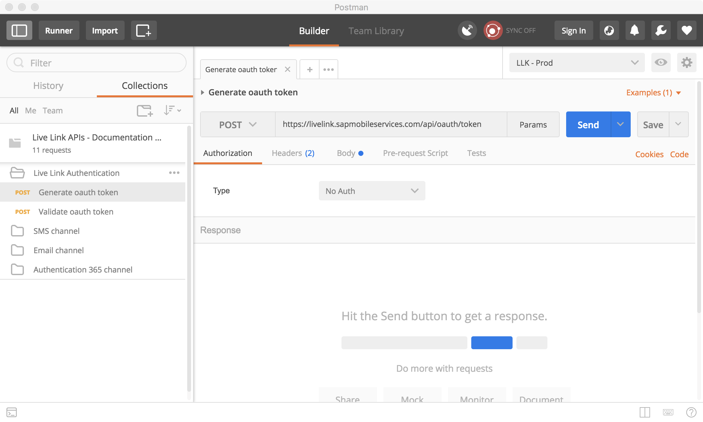
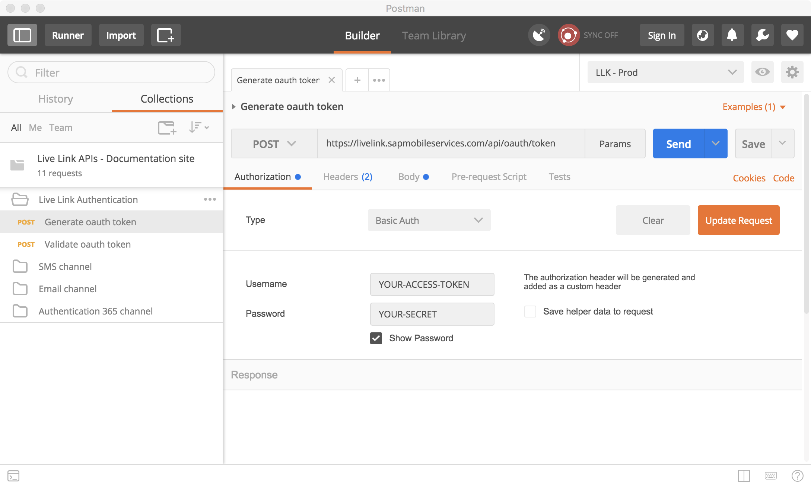
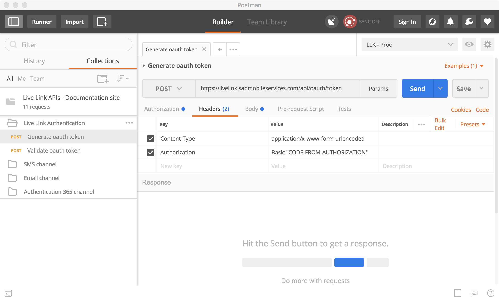

# Generate oAuth token

## About oAuth

OAuth \(or Open Authorization\) is an open protocol for token-based authentication. Also known as Open Authorization, is a standard that applications can use to provide client applications with secure access. 

An oAuth or access token is generated using user's credentials. The purpose of having this token is to use it every time an access validation needs to happen instead of always exchange the user's credentials, for example when calling an API. 

Access tokens have a limited lifetime, the expiration time is specified when generating the token itself. After an access token expires a new one must be generated to perform successful API calls. 


To learn more about oAuth you can visit [this](https://www.digitalocean.com/community/tutorials/an-introduction-to-oauth-2) site.


## Generate an oAuth access token

For Live Link APIs, an access token is always required, without it all API calls are going to respond with an error message. 

To generate an access token using postman collection follow the steps:

* Open the postman app
* Go into the collection, open "Live Link Authentication" folder and select "Generate oauth token" 

* In the Authorization tab, the app key and secret need to be provided to update the request with a valid authorization method and token.  
  1. In the type dropdown select "Basic Auth"
  2. Enter your app key and secret \(it must match one of the app keys in your Live Link account\)
  3. Click on "Update request" button 

* In the Headers tab, the authorization parameter has been added. Click on "Send" button to create a new oauth token. 

