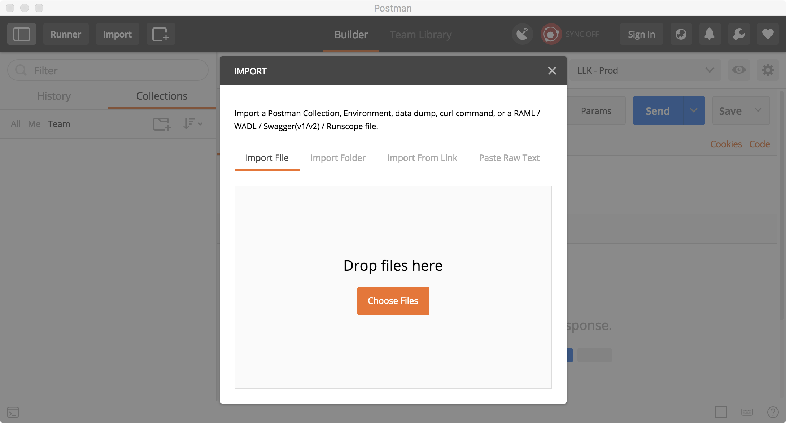

# How to import a postman collection

## About Postman

Postman is a tool widely used by developers to work with APIs in a faster and easier way. Postman is an app available to download for windows and mac users.

A postman collection is a format used to describe APIs. It includes the organization of the APIs \(if they are in folders\), the API definition, parameters used to build the request, response and examples \(if added\). It can also include tests and documentation. This collection can be exported/imported from postman as a JSON file.


 For more information regarding postman visit the official documentation site https://www.getpostman.com/docs/v6/

For more information regarding postman collection visit the collection section in the official documentation site https://www.getpostman.com/collection


## Download the Live Link postman collection

The Live Link Postman Collection is one JSON file that includes all Live Link APIs available. The collection is organized using folders, having one folder for each of our channels: SMS, Email and Authentication. There is also one additional folder for oauth authentication.

To download the Live Link postman collection, follow these steps:

1. In Live Link Documentation Site, go to API Reference
2. Click on "Download Collection" button. For this guide purpose, choose to download the entire collection.

## Import the Live Link postman collection

After downloading the collection from the Live Link Documentation site, the next step is to import the collection into Postman.

To import the collection, you should:

* Open postman app
* Click on "import" button

* On the Import popup, select "Import File" and click on "Choose files" 

* Look for the collection \(JSON file\) and click "Open" 
* The new collection should appear at the left side as "Live Link APIs – Documentation Site" 

